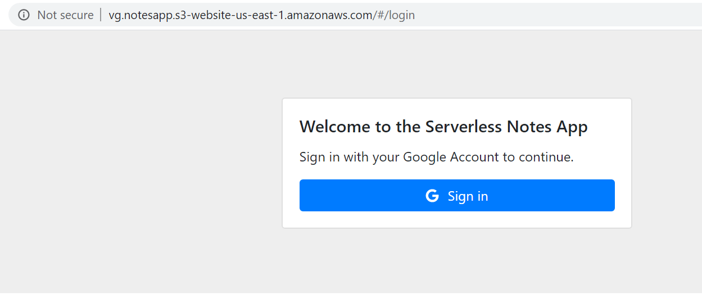
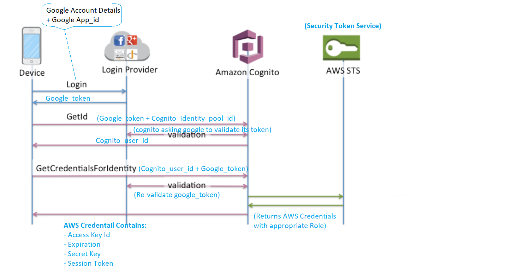
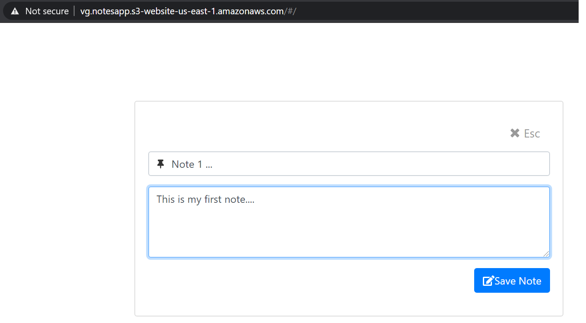
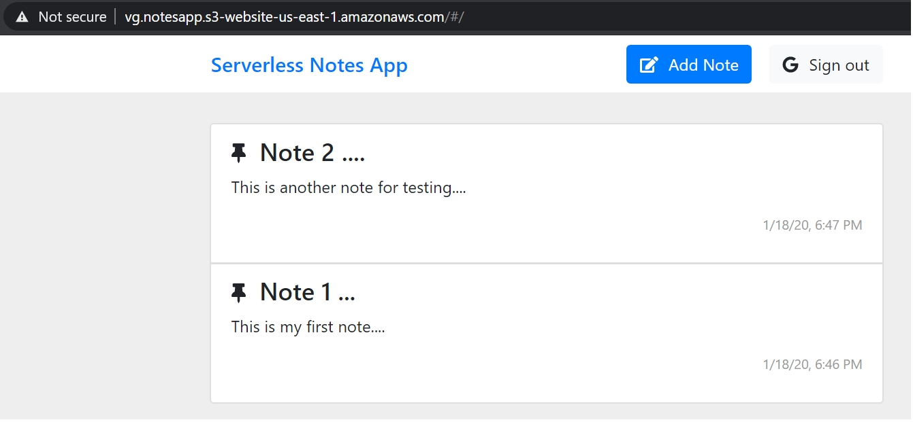

# Serverless Notes Application

# Notes Application : COMPONENTS

There are 7 Components:
1. Amazon API Gateway
2. Amazon S3 bucket
3. Google Cloud Platform
4. Amazon Cognito - Identity Pool
5. DynamoDB
6. Serverless Backend app
7. Serverless Frontend app

# SETUP
1. Do Git Pull for following 2 Repositories : 
	- serverless-notes-backend (URL: https://github.com/guptavinod/serverless-notes-backend) 
	- serverless-notes-webapp (URL:  https://github.com/guptavinod/serverless-notes-webapp)

2. Open both the projects folders in VS Code Editor

3. Create Amazon S3 public accessible bucket (e.g. vg.notesapp) with the property enabled as **"Static website hosting"** and provide index.html as index document. This will provide you an **Endpoint** similar to below:
```
 http://vg.notesapp.s3-website-us-east-1.amazonaws.com
```

4. Go to the Google Cloud Platform and create an Web application. From API & Services section, generate credentials for created web application, this will provide you **client ID** and **Client Secret Id** which will be required to configure Google Authentication providers in Amazon Cognito Identity Pool (see the next step)  

5. Go to Amazon Cognito and create Identity Pool. This will create Identity Pool ID and few default roles (e.g. Unauthenticated role and Authenticated role)
	- Go to the **Authentication providers** section and click on Google tab --> under google client Id enter **client ID** generated in step 4.
	
	- **Identity Pool ID :** This Id need to be placed in serverless.yml file of project "serverless-notes-backend"
	```
	provider:
	  name: aws
	  runtime: nodejs10.x
	  region: us-east-1
	  stage: dev
	  memorySize: 128
	  timeout: 5
	  endpointType: regional
	  environment:
		NOTES_TABLE: ${self:service}-${opt:stage, self:provider.stage}
		**COGNITO_IDENTITY_POOL_ID: us-east-1:555cb161-e348-44d0-b6d7-1daad84f76a6**
	```
 
	- **Authenticated role : ** Go to the IAM dashboard and search for serverless role created during identity pool creation (e.g. Cognito_ServerlessNotesAppAuth_Role ). Select this Role and provide In-line policy for executing APIs
	under Amazon API Gateway
	
6. Go the VS Studio for project "serverless-notes-backend" and run following commands:
	```
	> serverless create -t aws-nodejs -p serverless-notes-backend
	> npm init -y
	> npm install --save aws-sdk moment underscore uuid
	> serverless deploy
	```
	
	- Command "serverless deploy" will do following activities for you over the AWS
	```
	Serverless: Packaging service...
	Serverless: Excluding development dependencies...
	Serverless: Creating Stack...
	Serverless: Checking Stack create progress...
	........
	Serverless: Stack create finished...
	Serverless: Uploading CloudFormation file to S3...
	Serverless: Uploading artifacts...
	Serverless: Uploading service sls-notes-backend.zip file to S3 (13.04 MB)...
	Serverless: Validating template...
	Serverless: Updating Stack...
	Serverless: Checking Stack update progress...
	................................................................................................................................................
	Serverless: Stack update finished...
	Service Information
	service: sls-notes-backend  
	stage: dev
	region: us-east-1
	stack: sls-notes-backend-dev
	resources: 49
	api keys:
	  None
	endpoints:
	  GET - https://uc12g17vdg.execute-api.us-east-1.amazonaws.com/dev/auth
	  POST - https://uc12g17vdg.execute-api.us-east-1.amazonaws.com/dev/note
	  PATCH - https://uc12g17vdg.execute-api.us-east-1.amazonaws.com/dev/note
	  GET - https://uc12g17vdg.execute-api.us-east-1.amazonaws.com/dev/notes
	  GET - https://uc12g17vdg.execute-api.us-east-1.amazonaws.com/dev/note/n/{note_id}
	  DELETE - https://uc12g17vdg.execute-api.us-east-1.amazonaws.com/dev/note/t/{timestamp}
	functions:
	  authenticate-google: sls-notes-backend-dev-authenticate-google
	  add-note: sls-notes-backend-dev-add-note
	  update-note: sls-notes-backend-dev-update-note
	  get-notes: sls-notes-backend-dev-get-notes
	  get-note: sls-notes-backend-dev-get-note
	  delete-note: sls-notes-backend-dev-delete-note
	layers:
	  None
	Serverless: Run the "serverless" command to setup monitoring, troubleshooting and testing.
	```
	
7. Now go to the Amazon API Gateway, you can see all the functions deployed there and would be able to see their endpoints as well. Click on the left pane **Stages** --> click on specific stage (i.e dev) --> You will see the **Invoke URL** (i.e. https://uc12g17vdg.execute-api.us-east-1.amazonaws.com/dev)

8. We need to set Invoke URL path to variable **API_ROOT** within webpack.config.prod.js file of project serverless-notes-webapp. Now run following command in VS Code terminal:
	```
	> npm run build:prod
	```
	- This will build website code under folder **public**. Deploy this folder into S3 bucket i.e vg.notesapp (created in step 3)
	
9. Now, you can access the Notes application using ** S3 - Static website hosting"** URL:
	```
	http://vg.notesapp.s3-website-us-east-1.amazonaws.com
	```
	
	- You would be able to see UI(s)
	
	
	
	

	
	
	
10. **Clean UP Resources** - Go the VS Studio for project "serverless-notes-backend" and run following commands:
	```	
	> serverless remove
	```
   
	```
	Serverless: Getting all objects in S3 bucket...
	Serverless: Removing objects in S3 bucket...
	Serverless: Removing Stack...
	Serverless: Checking Stack removal progress...
	...........................................................................................
	Serverless: Stack removal finished...
	```

